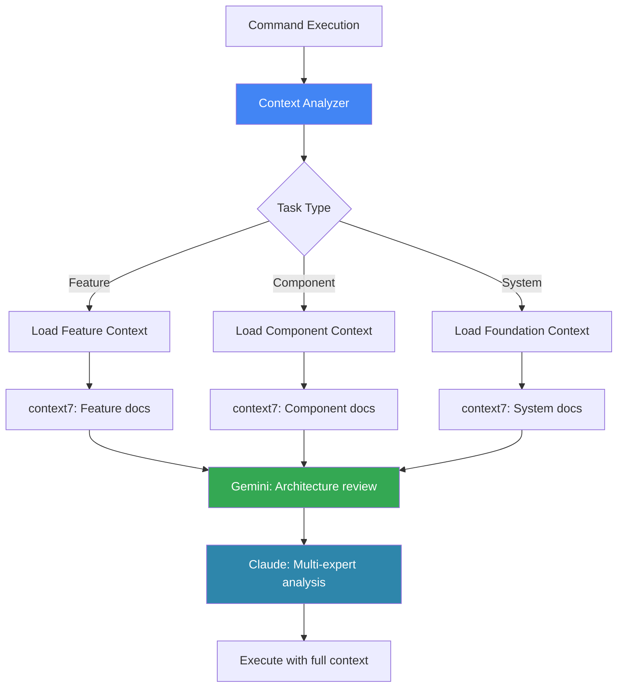
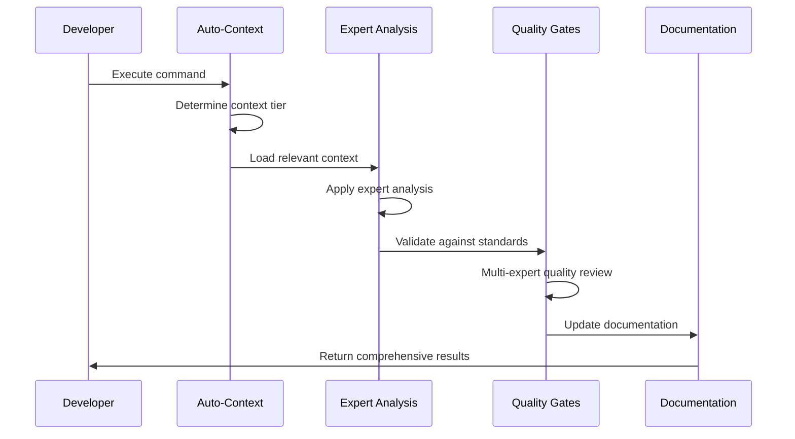

# Claude Code Development System - Ultimate Hybrid
**The Perfect Integration: Comprehensive Expert Analysis + Intelligent Automation**

## 🎯 System Overview

This hybrid system combines our comprehensive multi-expert analysis with Peter Krueck's brilliant auto-context management and documentation automation, creating the ultimate AI-enhanced development environment.


*Ultimate Hybrid Architecture - 4 Intelligence Layers: Intelligence, Auto-Context, Expert Analysis, and Automation*

## 🏗️ Enhanced Architecture

### 3-Tier Documentation System (Peter's Innovation)
**Intelligent Context Scoping for Optimal Token Usage**

```
project-root/
├── .claude/
│   ├── commands/              # Enhanced commands with auto-context
│   ├── images/                # System diagram images
│   │   ├── 4_intelligence_layers.png
│   │   ├── flows.png
│   │   ├── smart_context_loading_and_optimization_engine.png
│   │   ├── self_improving_system.png
│   │   ├── ai_enhanced_command.png
│   │   ├── context_sync.png
│   │   ├── bult_in_compliance.png
│   │   ├── intelligent_resource_management_and_cost_control.png
│   │   ├── native_ide_experience.png
│   │   └── data_drive_dev.png
│   └── README.md              # This documentation
├── docs/
│   ├── ai-context/           # Tier 1: Foundation Documentation
│   │   ├── docs-overview.md  # Documentation routing map
│   │   ├── project-structure.md # Complete tech stack + file tree
│   │   ├── system-integration.md # Cross-component patterns
│   │   ├── deployment-infrastructure.md # Infrastructure context
│   │   └── handoff.md        # Session continuity
│   ├── components/           # Tier 2: Component Documentation
│   │   ├── backend/CLAUDE.md # Backend-specific context
│   │   ├── frontend/CLAUDE.md # Frontend-specific context
│   │   └── database/CLAUDE.md # Database-specific context
│   └── features/             # Tier 3: Feature Documentation
│       ├── auth/CLAUDE.md    # Authentication feature context
│       ├── payment/CLAUDE.md # Payment feature context
│       └── analytics/CLAUDE.md # Analytics feature context
├── sessions/                 # Enhanced session tracking
├── plans/                    # Master coordination plans
├── PRPS/                     # Product Requirements Prompts
└── CLAUDE.md                 # Master AI context (Tier 1)
```

### Auto-Context Loading Rules


*Context Intelligence System - Automatically loads relevant context based on task complexity with smart pruning and optimization*

## 🚀 Enhanced Command System

### Universal Commands (Auto-Context Enabled)

#### `/project:start` - Enhanced Session Initialization
```markdown
# Enhanced Start Command with Auto-Context

Automatically loads relevant context based on task complexity and applies multi-expert analysis.

## Auto-Context Loading Logic
- **Simple tasks**: Feature-level context (Tier 3)
- **Medium tasks**: Component-level context (Tier 2) 
- **Complex tasks**: Foundation-level context (Tier 1)

## Multi-Expert Analysis Integration
Every start command includes:
- Architecture Specialist assessment
- Technology stack analysis
- Quality assurance planning
- Performance considerations
- Security evaluation
- User experience planning

## Usage
/project:start "implement user authentication" --auto-context
# → Automatically loads auth feature context if exists
# → Falls back to security component context
# → Applies security expert analysis
# → Provides comprehensive implementation strategy

/project:start "redesign system architecture" --auto-context
# → Loads foundation-level context (Tier 1)
# → Applies all expert perspectives
# → Provides enterprise-level architectural analysis
```

#### `/project:implement` - Simplified Implementation Command
```markdown
# Unified Implementation Command

Combines our expert analysis with Peter's auto-context and documentation maintenance.

## Auto-Context Features
- Automatically determines required context tier
- Loads relevant CLAUDE.md files
- Includes technology-specific documentation
- Routes to appropriate expert analysis

## Expert Analysis Integration
- Multi-expert implementation research
- Quality assurance validation
- Performance optimization guidance
- Security implementation review

## Self-Maintaining Documentation
- Updates affected CLAUDE.md files across all tiers
- Maintains project-structure.md currency
- Keeps docs-overview.md routing accurate
- Preserves context for future sessions

## Usage
/project:implement "add JWT authentication to API endpoints"
# → Auto-loads: backend/CLAUDE.md, auth/CLAUDE.md, project-structure.md
# → Applies: Security Expert, Backend Specialist, API Architecture Expert
# → Implements: Secure JWT implementation with comprehensive validation
# → Updates: All relevant documentation tiers automatically
```

#### `/project:analyze` - Enhanced Analysis with Gemini Integration
```markdown
# Comprehensive Analysis with Large Context Support

Combines our multi-expert analysis with Gemini CLI for massive codebase understanding.

## Dual Analysis Approach
1. **Gemini Analysis**: Complete codebase understanding with massive context
2. **Claude Analysis**: Multi-expert perspective synthesis and strategic planning

## Auto-Context Integration
- Loads relevant documentation based on analysis scope
- Includes cross-component dependencies
- Provides technology-specific context
- Maintains analysis history

## Usage
/project:analyze "assess security posture across entire application"
# → Gemini: gemini -p "@./ Complete security analysis of entire codebase"
# → Claude: Multi-expert security assessment with:
#   - Security Architecture Expert
#   - Compliance Specialist  
#   - Performance Security Expert
#   - Integration Security Analyst
# → Auto-loads: All security-related CLAUDE.md files
# → Updates: security assessment documentation
```

#### `/project:review` - Intelligent Code Review
```markdown
# AI-Assisted Code Review with Context Awareness

Multi-agent code review that understands project patterns and standards.

## Auto-Context Loading
- Loads relevant coding standards from CLAUDE.md files
- Includes component-specific patterns
- References related feature implementations
- Maintains review consistency

## Multi-Expert Review Process
- **Code Quality Expert**: Style, maintainability, best practices
- **Security Specialist**: Vulnerability assessment, secure coding
- **Performance Engineer**: Performance implications, optimization opportunities
- **Architecture Reviewer**: Design pattern compliance, system integration

## Usage
/project:review "review authentication implementation changes"
# → Auto-loads: auth/CLAUDE.md, backend/CLAUDE.md, security standards
# → Spawns: Security, Backend, API, and Integration review agents
# → Provides: Comprehensive review with specific improvement recommendations
# → Updates: Code review patterns and standards documentation
```

#### `/project:update-docs` - Intelligent Documentation Maintenance
```markdown
# Self-Maintaining Documentation System

Automatically updates all documentation tiers to maintain consistency and currency.

## Intelligent Update Logic
- Identifies affected documentation based on changes
- Updates CLAUDE.md files across relevant tiers
- Maintains cross-references and dependencies
- Preserves historical context

## Multi-Tier Synchronization
- **Tier 1**: Foundation documentation for system-wide changes
- **Tier 2**: Component documentation for module-specific changes  
- **Tier 3**: Feature documentation for granular changes

## Usage
/project:update-docs --session-current --sync-all-tiers
# → Analyzes: Changes made during current session
# → Updates: All affected CLAUDE.md files
# → Maintains: Documentation routing and cross-references
# → Preserves: Context for future AI sessions
```

## 🧠 Continuous Learning & Intelligence

### Self-Improving System Architecture


*Continuous Learning Architecture - The system learns from every interaction, building pattern libraries and improving recommendations over time*

### Enhanced Command Intelligence


*Intelligent Command Integration - Every command benefits from context intelligence, pattern matching, and multi-expert analysis*

## 🤝 Team Collaboration & Synchronization

### Real-time Context Sharing


*Real-time Team Collaboration - Seamless context synchronization and pattern sharing across development teams*

## 🔐 Security & Compliance Integration

### Built-in Compliance Framework


*Security & Compliance Automation - Automatic validation against GDPR, HIPAA, SOX, PCI-DSS and other standards*

## 💰 Cost & Performance Optimization

### Intelligent Resource Management


*Cost & Performance Optimization - Smart resource usage with real-time monitoring and automatic optimization*

## 🖥️ IDE Deep Integration

### Native Development Experience


*IDE Deep Integration - Seamless integration with development environments providing real-time intelligence and assistance*

## 📊 Team Analytics & Insights

### Data-Driven Development Intelligence


*Team Analytics & Insights - Comprehensive analytics for development velocity, code quality, and team performance optimization*

## 🔀 Enhanced Flow Integration

### Flow 1: PRD → Multiple PRPs (Enterprise Coordination)
**Auto-Context Enhanced Multi-Team Development**

```bash
# Step 1: Auto-Context PRD Analysis
/project:analyze-prd docs/requirements.md --auto-context
# → Auto-loads: CLAUDE.md, project-structure.md, system-integration.md
# → Applies: 10+ expert perspectives with full project context
# → Generates: Comprehensive analysis with automatic documentation

# Step 2: Master Plan with Context Awareness
/project:generate-task-plan analysis/prd_analysis_[timestamp].md --auto-context
# → Auto-loads: All foundation documentation for coordination planning
# → Creates: Master plan with intelligent PRP decomposition
# → Updates: Master coordination documentation automatically

# Step 3: Context-Aware PRP Generation
/project:generate-prp plans/master_plan_[timestamp].md --prp=1 --auto-context
# → Auto-loads: Relevant component and foundation context
# → Generates: PRP with comprehensive implementation research
# → Creates: Component-specific CLAUDE.md files

# Step 4: Intelligent PRP Execution
/project:execute-prp PRPS/prp_foundation_[timestamp].md --auto-context
# → Auto-loads: All relevant context for implementation
# → Executes: With real-time MCP server integration
# → Maintains: Documentation currency throughout implementation

# Step 5: Automated Progress Tracking
/project:track-progress plans/master_plan_[timestamp].md --auto-docs
# → Auto-updates: All affected documentation
# → Maintains: Cross-PRP coordination context
# → Provides: Real-time coordination intelligence
```

### Flow 2: Single Feature Development (Auto-Context Enhanced)
**Intelligent Feature Development with Perfect Context**

```bash
# Step 1: Context-Aware Feature Analysis
/project:analyze "implement real-time notifications with WebSocket" --auto-context
# → Auto-loads: notifications/CLAUDE.md (if exists), backend/CLAUDE.md
# → Applies: Rapid multi-expert analysis with technology-specific context
# → Creates/Updates: Feature-specific documentation

# Step 2: Intelligent Implementation
/project:implement "real-time notifications system" --auto-context
# → Auto-loads: WebSocket patterns, notification standards, backend context
# → Executes: Implementation with MCP server integration
# → Updates: All affected documentation tiers automatically

# Step 3: Automated Validation
/project:validate "notifications feature implementation" --auto-context
# → Auto-loads: Testing standards, performance benchmarks
# → Executes: Comprehensive validation with quality gates
# → Finalizes: Feature documentation and integration guides
```

### Flow 3: Existing Project Integration (Context-Aware Legacy Integration)
**Smart Integration with Legacy System Understanding**

```bash
# Step 1: Comprehensive Legacy Analysis
/project:analyze-existing --deep-scan --auto-context
# → Gemini: Complete codebase analysis with massive context window
# → Claude: Multi-expert integration assessment with auto-loaded standards
# → Creates: Complete 3-tier documentation structure for legacy system

# Step 2: Context-Aware Integration Planning
/project:generate-context analysis/existing_analysis_[timestamp].md --auto-context
# → Auto-loads: Integration patterns, technology compatibility guides
# → Creates: Technology-specific integration context
# → Establishes: Team adoption and training documentation

# Step 3: Intelligent Workflow Adaptation
/project:adapt-workflow context/project_context_[timestamp].md --auto-context
# → Auto-loads: Team workflow patterns, development standards
# → Implements: Custom commands with auto-context loading
# → Establishes: Self-maintaining documentation system
```

## 🔌 Enhanced MCP Server Integration

### Core Development Servers (Auto-Context Enabled)

```json
{
  "mcpServers": {
    "filesystem": {
      "command": "npx",
      "args": ["@modelcontextprotocol/server-filesystem", "/path/to/project"],
      "autoContext": true
    },
    "git": {
      "command": "npx", 
      "args": ["@modelcontextprotocol/server-git", "/path/to/project"],
      "autoContext": true
    },
    "context7": {
      "command": "npx",
      "args": ["@upstash/context7"],
      "autoLoad": ["documentation", "api-specs"]
    },
    "gemini": {
      "command": "npx",
      "args": ["mcp-gemini-assistant"],
      "env": {
        "GEMINI_API_KEY": "your-api-key"
      },
      "autoConsult": true
    }
  }
}
```

### Smart Context Routing



## 🎯 Quality Assurance Integration

### Auto-Context Quality Gates



### Enhanced Quality Validation

```bash
# Automatic quality validation with context awareness
/project:validate --auto-context --comprehensive
# → Auto-loads: Quality standards from all relevant tiers
# → Applies: Multi-expert quality assessment
# → Validates: Against project-specific standards
# → Updates: Quality metrics and improvement documentation
```

## 🚀 Implementation Strategy

### Phase 1: Foundation Enhancement (Week 1)
**Implement Auto-Context Loading & Setup Images**

```bash
# Set up enhanced directory structure
mkdir -p docs/ai-context docs/components docs/features
mkdir -p .claude/commands .claude/images sessions plans PRPS

# Save system diagrams to .claude/images/ directory
# Download diagrams from the rendered HTML artifacts and save as:
# - 4_intelligence_layers.png
# - flows.png  
# - smart_context_loading_and_optimization_engine.png
# - self_improving_system.png
# - ai_enhanced_command.png
# - context_sync.png
# - bult_in_compliance.png
# - intelligent_resource_management_and_cost_control.png
# - native_ide_experience.png
# - data_drive_dev.png

# Create foundation documentation
touch CLAUDE.md
touch docs/ai-context/{docs-overview,project-structure,system-integration,deployment-infrastructure,handoff}.md

# Implement auto-context commands
/project:setup-auto-context --initialize-tiers
```

### Phase 2: Expert Analysis Integration (Week 2)
**Combine Multi-Expert Analysis with Auto-Context**

```bash
# Enhanced command implementation
/project:implement-enhanced-commands --auto-context --expert-analysis

# Test integrated workflow
/project:start "test auto-context integration" --validate-experts
```

### Phase 3: Documentation Automation (Week 3)
**Implement Self-Maintaining Documentation**

```bash
# Set up documentation automation
/project:setup-auto-docs --sync-all-tiers --continuous-updates

# Test documentation maintenance
/project:update-docs --validate-automation
```

### Phase 4: MCP Integration Enhancement (Week 4)
**Integrate Enhanced MCP Servers with Auto-Context**

```bash
# Configure enhanced MCP servers
/project:setup-mcp-enhanced --context7 --gemini --auto-routing

# Validate complete integration
/project:validate-system --comprehensive --all-flows
```

## 💡 Key Advantages of Hybrid System

### **From Peter's System:**
✅ **Auto-loading context** - Eliminates manual context management  
✅ **3-tier documentation** - Smart context scoping by complexity  
✅ **Self-maintaining docs** - Automatic documentation synchronization  
✅ **Simplified commands** - Reduced cognitive overhead  

### **From Our System:**
✅ **Multi-expert analysis** - 8-12 expert perspectives on every task  
✅ **Three development flows** - Handle different project scenarios  
✅ **Quality assurance gates** - Comprehensive validation frameworks  
✅ **Enterprise coordination** - Multi-team and enterprise capabilities  

### **Unique Hybrid Benefits:**
🚀 **Intelligent automation** with **comprehensive analysis**  
🚀 **Zero manual context management** with **expert guidance**  
🚀 **Self-maintaining documentation** with **quality validation**  
🚀 **Simple commands** with **sophisticated capabilities**  

## 🎯 Usage Examples

### **Simple Feature Development**
```bash
/project:implement "add password reset functionality"
# → Auto-loads: auth/CLAUDE.md, security standards
# → Applies: Security Expert, Backend Specialist, UX Expert  
# → Implements: Secure password reset with email validation
# → Updates: Authentication and security documentation
```

### **Complex System Integration**  
```bash
/project:analyze "integrate payment processing with existing order system"
# → Auto-loads: Foundation context, payment/CLAUDE.md, orders/CLAUDE.md
# → Applies: Integration Architect, Security Expert, Performance Engineer
# → Provides: Comprehensive integration strategy with risk assessment
# → Creates: Integration documentation and implementation plan
```

### **Legacy System Enhancement**
```bash
/project:enhance "modernize authentication system in legacy codebase"
# → Gemini: Complete legacy codebase analysis
# → Auto-loads: Legacy integration patterns, modern auth standards  
# → Applies: Migration Specialist, Security Expert, Legacy Integration Expert
# → Provides: Safe modernization strategy with rollback procedures
# → Creates: Migration documentation and team training materials
```

## 🏆 The Ultimate Development Experience

This hybrid system delivers:

**🎯 Perfect Context** - Always the right information, automatically loaded  
**🧠 Expert Guidance** - Multi-expert analysis on every decision  
**📚 Living Documentation** - Self-maintaining, always current  
**⚡ Zero Overhead** - Intelligent automation with simple commands  
**🔄 Continuous Learning** - System improves with every interaction  
**🏢 Enterprise Ready** - Governance, compliance, and team coordination  

**The result:** Development teams that move faster, build better quality software, and maintain comprehensive project knowledge without manual overhead.

---

**🚀 Ready to transform your development workflow?**

```bash
# Start with any project type
/project:start "your development goal" --auto-context

# Experience the perfect combination of automation and expertise
```

*Intelligent automation meets comprehensive expertise - the ultimate AI-enhanced development system.*