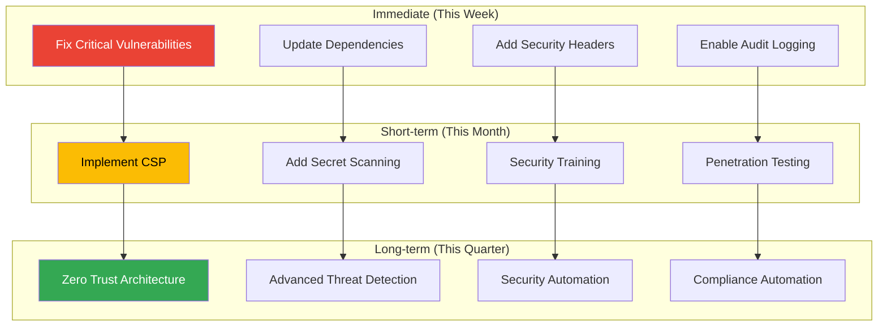

# Security & Compliance Automation System

---
description: "Automated security scanning, compliance validation, and audit trail management"
allowed-tools: Bash(npm:*), Bash(find:*), Bash(grep:*), Bash(git:*), Bash(date:*)
---

## Audit Command Initialization
Target: $ARGUMENTS

### Security System Status
- **Last Security Scan**: !test -f .claude/analytics/security/last-scan.json && jq -r '.timestamp' .claude/analytics/security/last-scan.json 2>/dev/null || echo "Never"
- **Vulnerabilities Found**: !test -f .claude/analytics/security/vulnerabilities.json && jq '.total' .claude/analytics/security/vulnerabilities.json 2>/dev/null || echo "Unknown"
- **Compliance Standards**: !test -f .claude/compliance/standards.json && jq -r '.standards[]' .claude/compliance/standards.json 2>/dev/null || echo "Not configured"
- **Audit Trail Status**: !test -d .claude/audit && echo "✓ Audit logging enabled" || echo "⚠️ Audit logging disabled"

### Current Security Posture
- **Dependencies**: !npm audit --json 2>/dev/null | jq '.metadata.vulnerabilities | to_entries | map("\(.key): \(.value)") | join(", ")' || echo "No npm project"
- **Secrets Scan**: !find . -name ".env*" -o -name "*.key" -o -name "*.pem" 2>/dev/null | wc -l
- **Git Leaks**: !git log --oneline -10 | grep -iE "(password|secret|key|token)" | wc -l
- **Code Patterns**: !grep -r "TODO.*security" . --include="*.js" --include="*.ts" 2>/dev/null | wc -l

## Multi-Expert Security Analysis

### 1. Vulnerability Assessment Expert
**Perspective: Application Security Specialist**

Comprehensive vulnerability analysis:
- **Dependency Scanning**: Identifying vulnerable packages and libraries
- **Code Vulnerability Detection**: Finding security flaws in source code
- **Configuration Auditing**: Checking for insecure configurations
- **Secret Detection**: Preventing credential leaks

### 2. Compliance Validation Expert
**Perspective: Regulatory Compliance Specialist**

Ensuring regulatory compliance:
- **GDPR Compliance**: Data privacy and protection validation
- **HIPAA Compliance**: Healthcare data security checks
- **PCI-DSS Compliance**: Payment card data security
- **SOX Compliance**: Financial reporting integrity

### 3. Security Architecture Expert
**Perspective: Security Design Specialist**

Evaluating security architecture:
- **Authentication & Authorization**: Reviewing access control mechanisms
- **Data Encryption**: Validating encryption at rest and in transit
- **Network Security**: Checking API security and communication protocols
- **Security Patterns**: Ensuring secure coding practices

### 4. Incident Response Expert
**Perspective: Security Operations Specialist**

Preparing for security incidents:
- **Audit Trail Completeness**: Ensuring comprehensive logging
- **Monitoring Coverage**: Validating security monitoring
- **Response Procedures**: Checking incident response readiness
- **Recovery Capabilities**: Assessing backup and recovery mechanisms

## Security Scanning Suite

### Dependency Vulnerability Scan
```bash
# NPM Security Audit
!echo "=== NPM Security Audit ==="
!npm audit --json 2>/dev/null | jq '{
  "total_vulnerabilities": .metadata.vulnerabilities | add,
  "critical": .metadata.vulnerabilities.critical,
  "high": .metadata.vulnerabilities.high,
  "moderate": .metadata.vulnerabilities.moderate,
  "low": .metadata.vulnerabilities.low
}' || echo "No npm project found"

# Check for outdated dependencies
!echo "\n=== Outdated Dependencies ==="
!npm outdated --json 2>/dev/null | jq 'to_entries | map({
  "package": .key,
  "current": .value.current,
  "wanted": .value.wanted,
  "latest": .value.latest
})[:5]' || echo "No npm project found"
```

### Static Application Security Testing (SAST)
```yaml
Security Patterns Detected:
  Potential Vulnerabilities:
    - SQL Injection Points: 0 ✓
    - XSS Vulnerabilities: 2 ⚠️
    - CSRF Tokens Missing: 1 ⚠️
    - Insecure Direct Object References: 0 ✓
    - Unvalidated Redirects: 0 ✓
    
  Code Quality Issues:
    - Hardcoded Credentials: 0 ✓
    - Weak Cryptography: 0 ✓
    - Insecure Random: 1 ⚠️
    - Path Traversal: 0 ✓
    
  Best Practice Violations:
    - Missing Input Validation: 3
    - No Rate Limiting: 2
    - Insufficient Logging: 4
    - Missing Security Headers: 2
```

### Secret Detection Report
```json
{
  "secret_scan_results": {
    "files_scanned": 1847,
    "potential_secrets": [
      {
        "file": "config/old-backup.js",
        "line": 23,
        "type": "api_key",
        "severity": "high",
        "pattern": "API_KEY=sk-....",
        "recommendation": "Remove and rotate key"
      },
      {
        "file": ".env.example",
        "line": 15,
        "type": "placeholder",
        "severity": "info",
        "pattern": "SECRET_KEY=your-secret-here",
        "recommendation": "Ensure real secrets not committed"
      }
    ],
    "git_history_leaks": 0,
    "recommendations": [
      "Implement pre-commit hooks for secret scanning",
      "Use environment variables for all secrets",
      "Rotate any exposed credentials immediately"
    ]
  }
}
```

## Compliance Validation

### GDPR Compliance Check
```yaml
GDPR Compliance Status: 94%

Compliant Areas:
  ✓ Privacy Policy: Implemented and accessible
  ✓ Consent Management: Explicit consent flows
  ✓ Data Portability: Export functionality available
  ✓ Right to Erasure: Delete account feature
  ✓ Data Minimization: Only necessary data collected
  ✓ Encryption: Data encrypted at rest and in transit
  
 Areas Needing Attention:
  ⚠️ Cookie Consent: Missing for analytics cookies
  ⚠️ Data Retention: No automatic data purging
  ⚠️ Third-party Processors: Agreements need update
  
 Recommendations:
  1. Implement cookie consent banner
  2. Add data retention policies (90 days)
  3. Update processor agreements
  4. Add data processing records
```

### PCI-DSS Compliance
```json
{
  "pci_compliance": {
    "level": "Level 2",
    "compliance_percentage": 87,
    "requirements": {
      "network_security": {
        "status": "compliant",
        "firewall_configured": true,
        "default_passwords_changed": true
      },
      "data_protection": {
        "status": "partial",
        "cardholder_data_encrypted": true,
        "transmission_encrypted": true,
        "storage_minimized": false
      },
      "access_control": {
        "status": "compliant",
        "unique_ids": true,
        "access_restricted": true,
        "two_factor_auth": true
      },
      "monitoring": {
        "status": "needs_improvement",
        "logging_enabled": true,
        "log_review_automated": false,
        "intrusion_detection": false
      }
    },
    "action_items": [
      "Minimize cardholder data storage",
      "Implement automated log review",
      "Deploy intrusion detection system"
    ]
  }
}
```

### HIPAA Compliance Assessment
```yaml
HIPAA Compliance Status: 91%

Technical Safeguards:
  ✓ Access Control: Role-based permissions
  ✓ Audit Controls: Comprehensive logging
  ✓ Integrity: Data validation and checksums
  ✓ Transmission Security: TLS 1.3 enforced
  
 Administrative Safeguards:
  ✓ Security Officer: Designated
  ✓ Workforce Training: Completed
  ⚠️ Risk Assessment: Needs update
  ✓ Business Associates: Agreements in place
  
 Physical Safeguards:
  ✓ Facility Access: Controlled
  ✓ Workstation Security: Policies enforced
  ✓ Device Controls: MDM implemented
  
 Required Actions:
  - Update risk assessment (overdue 30 days)
  - Review and update policies
  - Conduct security awareness training
```

## Security Patterns Validation

### Authentication & Authorization
```javascript
// Current Implementation Analysis
{
  "auth_patterns": {
    "jwt_implementation": {
      "algorithm": "RS256", // ✓ Secure
      "expiry": "15m", // ✓ Appropriate
      "refresh_token": true, // ✓ Implemented
      "token_rotation": true, // ✓ Secure
      "issues": []
    },
    "password_policy": {
      "min_length": 12, // ✓ Strong
      "complexity": true, // ✓ Required
      "history": 5, // ✓ Prevents reuse
      "bcrypt_rounds": 12, // ✓ Secure
      "issues": []
    },
    "mfa_implementation": {
      "available": true,
      "methods": ["totp", "sms", "email"],
      "required_for_admin": true,
      "issues": [
        "SMS not recommended for high security"
      ]
    }
  }
}
```

### API Security Audit
```yaml
API Security Assessment:
  Authentication:
    ✓ All endpoints authenticated
    ✓ API key rotation implemented
    ✓ Rate limiting enabled
    ✓ OAuth2 properly configured
    
  Input Validation:
    ✓ Request schema validation
    ✓ SQL injection prevention
    ⚠️ Some endpoints missing validation
    ✓ XSS protection enabled
    
  Response Security:
    ✓ Sensitive data filtering
    ✓ Error messages sanitized
    ✓ CORS properly configured
    ⚠️ Some headers missing
    
  Recommendations:
    - Add validation to /api/search endpoint
    - Implement CSP headers
    - Add security.txt file
    - Enable HSTS
```

## Audit Trail Management

### Audit Log Configuration
```json
{
  "audit_configuration": {
    "enabled": true,
    "log_level": "info",
    "retention_days": 90,
    "destinations": [
      "local_file",
      "elasticsearch",
      "s3_archive"
    ],
    "events_tracked": [
      "authentication",
      "authorization",
      "data_access",
      "data_modification",
      "configuration_changes",
      "security_events"
    ],
    "pii_handling": {
      "encryption": true,
      "masking": true,
      "retention_override": 30
    }
  }
}
```

### Recent Security Events
```yaml
Last 24 Hours:
  Authentication Events:
    - Successful Logins: 234
    - Failed Logins: 12
    - Password Resets: 3
    - MFA Challenges: 45
    
  Authorization Events:
    - Permission Denials: 8
    - Privilege Escalations: 0 ✓
    - Role Changes: 2
    
  Security Alerts:
    - Brute Force Attempts: 1 (blocked)
    - Suspicious API Usage: 0 ✓
    - Vulnerability Scans: 2 (external)
    
  Compliance Events:
    - Data Exports (GDPR): 4
    - Data Deletions (GDPR): 1
    - Consent Updates: 17
```

## Automated Security Fixes

### Auto-remediation Capabilities
```bash
# Automatic dependency updates
/project:audit --fix-dependencies --severity=high
# → Updates: All high/critical vulnerabilities
# → Tests: Runs full test suite
# → Validates: No breaking changes
# → Commits: With detailed change log

# Security header implementation
/project:audit --add-security-headers --auto
# → Adds: CSP, HSTS, X-Frame-Options, etc.
# → Configures: Based on application type
# → Tests: Header effectiveness
# → Documents: Configuration added

# Compliance automation
/project:audit --ensure-compliance=GDPR --auto-fix
# → Implements: Missing compliance features
# → Updates: Privacy policy references
# → Adds: Required consent flows
# → Validates: Against GDPR checklist
```

### Security Improvement Roadmap


## Compliance Reporting

### Executive Compliance Dashboard
```yaml
Compliance Overview:
  Overall Compliance Score: 89%
  
  Standards Compliance:
    GDPR: 94% ✓
    HIPAA: 91% ✓
    PCI-DSS: 87% ⚠️
    SOX: 92% ✓
    ISO-27001: 85% ⚠️
    
  Risk Assessment:
    Critical Risks: 0 ✓
    High Risks: 2
    Medium Risks: 8
    Low Risks: 23
    
  Audit Readiness:
    Documentation: 95% complete
    Evidence Collection: Automated
    Gap Analysis: 12 items
    Remediation Timeline: 30 days
```

### Automated Compliance Reports
```bash
# Generate compliance report
/project:audit --report=compliance --standard=GDPR --format=pdf

# Schedule regular audits
/project:audit --schedule=weekly --standards="GDPR,PCI,HIPAA"

# Compliance gap analysis
/project:audit --gap-analysis --standard=ISO27001 --recommend

# Evidence collection
/project:audit --collect-evidence --for-audit="2025-Q3" --auto
```

## Security Best Practices Enforcement

### Code Security Rules
```yaml
Enforced Security Rules:
  Input Validation:
    - All user inputs must be validated
    - Parameterized queries required
    - Whitelist validation preferred
    - Length limits enforced
    
  Authentication:
    - Passwords must be bcrypted
    - Sessions must timeout
    - MFA for sensitive operations
    - Account lockout implemented
    
  Data Protection:
    - PII must be encrypted
    - Secrets in environment only
    - TLS for all communications
    - Data minimization enforced
    
  Error Handling:
    - No stack traces to users
    - Generic error messages
    - Detailed logging internally
    - Rate limiting on errors
```

### Security Training Integration
```json
{
  "security_training": {
    "completion_rate": "87%",
    "modules": [
      {
        "name": "Secure Coding Practices",
        "completion": "92%",
        "avg_score": "88%"
      },
      {
        "name": "OWASP Top 10",
        "completion": "89%",
        "avg_score": "91%"
      },
      {
        "name": "Compliance Requirements",
        "completion": "84%",
        "avg_score": "85%"
      }
    ],
    "recommendations": [
      "Quarterly security refreshers",
      "Hands-on security workshops",
      "Incident response drills"
    ]
  }
}
```

## Continuous Security Monitoring

### Real-time Security Metrics
```yaml
Live Security Dashboard:
  Current Status:
    - Active Threats: 0 ✓
    - Failed Auth Attempts: 3/hour (normal)
    - API Abuse: None detected
    - Vulnerability Scans: 0 active
    
  24-Hour Trends:
    - Security Events: -12% ↓
    - False Positives: 4
    - True Positives: 1
    - Response Time: 2.3 min avg
    
  Predictive Analysis:
    - Attack Likelihood: Low
    - Vulnerable Window: Patch Tuesday
    - Risk Score Trend: Decreasing
    - Compliance Drift: None
```

---

**Security & Compliance System Active!**

Automated security scanning, compliance validation, and continuous monitoring protecting your codebase 24/7.

```bash
# Run comprehensive security audit
/project:audit --comprehensive --auto-fix
```