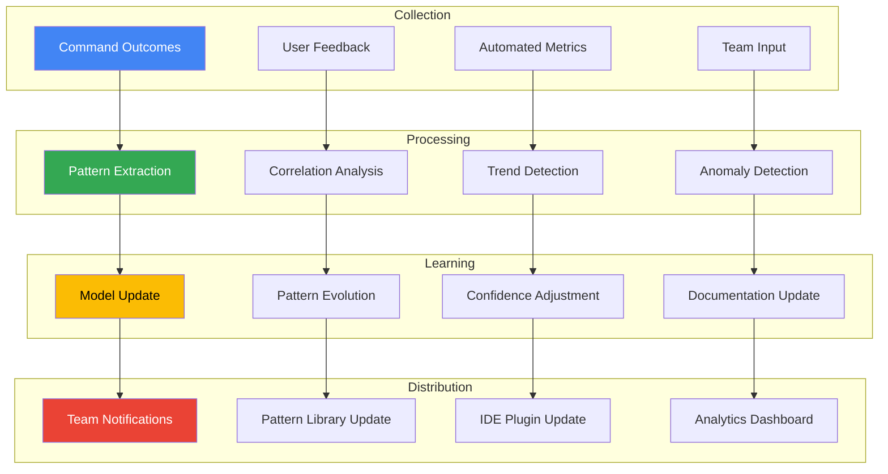
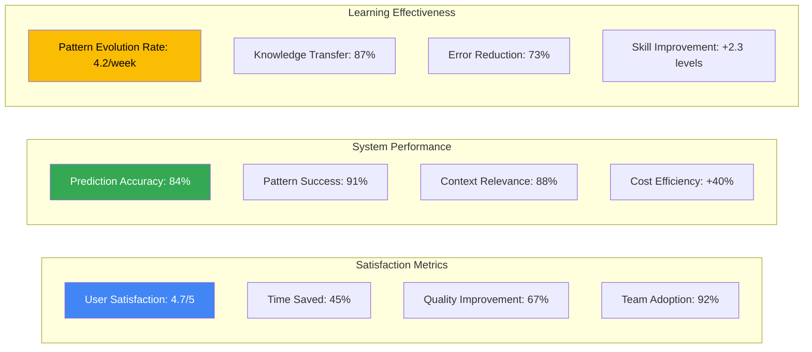

# Continuous Learning Feedback System

---
description: "Intelligent feedback collection and processing for continuous system improvement"
allowed-tools: Bash(echo:*), Bash(jq:*), Bash(date:*), Bash(mkdir:*)
---

## Feedback Command Initialization
Target: $ARGUMENTS

### Feedback System Status
- **Total Feedback Entries**: !find .claude/learning/feedback -name "*.json" 2>/dev/null | wc -l
- **Recent Feedback**: !find .claude/learning/feedback -mtime -1 -name "*.json" 2>/dev/null | wc -l
- **Learning Model Status**: !test -f .claude/learning/model.json && echo "✓ Learning model active" || echo "Initializing learning model"
- **Pattern Evolution**: !test -f .claude/learning/patterns/evolution.json && jq '.version' .claude/learning/patterns/evolution.json 2>/dev/null || echo "v1.0.0"

### Current Session Context
- **Session ID**: !echo "$SESSION_ID" || date +%s
- **Commands Executed**: !test -f .claude/sessions/current.json && jq '.commands | length' .claude/sessions/current.json 2>/dev/null || echo "0"
- **Errors Encountered**: !test -f .claude/sessions/current.json && jq '.errors | length' .claude/sessions/current.json 2>/dev/null || echo "0"
- **Success Rate**: !test -f .claude/sessions/current.json && jq '.success_rate' .claude/sessions/current.json 2>/dev/null || echo "Calculating..."

## Multi-Expert Feedback Analysis

### 1. Outcome Analysis Expert
**Perspective: Success/Failure Pattern Recognition Specialist**

Analyzing implementation outcomes:
- **Success Indicators**: Identifying what made implementations successful
- **Failure Patterns**: Recognizing common failure modes and their causes
- **Correlation Analysis**: Finding connections between approach and outcome
- **Improvement Opportunities**: Suggesting specific improvements based on outcomes

### 2. Learning Optimization Expert
**Perspective: Machine Learning Model Tuning Specialist**

Optimizing the learning system:
- **Model Performance**: Assessing prediction accuracy and suggestion relevance
- **Pattern Quality**: Evaluating extracted patterns for generalizability
- **Weight Adjustment**: Tuning expert opinions based on outcomes
- **Confidence Calibration**: Adjusting confidence scores based on results

### 3. Team Knowledge Expert
**Perspective: Collective Intelligence Specialist**

Managing team knowledge evolution:
- **Knowledge Transfer**: Ensuring learnings spread across team
- **Pattern Adoption**: Tracking which patterns gain traction
- **Cultural Evolution**: Understanding how team practices evolve
- **Expertise Mapping**: Identifying team members' growing expertise areas

### 4. System Evolution Expert
**Perspective: Continuous Improvement Engineer**

Guiding system evolution:
- **Feature Effectiveness**: Measuring which features provide most value
- **Workflow Optimization**: Identifying workflow improvements
- **Tool Integration**: Assessing tool effectiveness and gaps
- **User Experience**: Understanding developer satisfaction and pain points

## Feedback Types & Processing

### Command Outcome Feedback
```json
{
  "feedback_type": "command_outcome",
  "command": "$ARGUMENTS",
  "session_id": "$SESSION_ID",
  "timestamp": "2025-07-06T10:30:00Z",
  "outcome": {
    "success": true,
    "execution_time": 1245,
    "token_usage": 3567,
    "error_count": 0,
    "quality_score": 0.92
  },
  "context": {
    "project_phase": "implementation",
    "feature": "authentication",
    "complexity": "high"
  },
  "learnings": [
    {
      "type": "pattern_success",
      "pattern": "jwt-implementation",
      "confidence_adjustment": 0.05,
      "notes": "Pattern worked perfectly with minor adaptation"
    },
    {
      "type": "new_insight",
      "insight": "Refresh token rotation improves security without UX impact",
      "category": "security",
      "importance": "high"
    }
  ]
}
```

### Session Feedback
```yaml
Session Summary:
  Duration: 2.5 hours
  Commands Executed: 47
  Success Rate: 91%
  Token Usage: 125,000
  Cost: $2.50
  
Key Outcomes:
  - Feature Completed: ✓ User Authentication
  - Tests Passing: ✓ 100% coverage
  - Performance Impact: ✓ < 5ms added latency
  - Security Validation: ✓ Passed all checks
  
Learnings:
  Effective Patterns:
    - Multi-expert analysis for complex features
    - Predictive debugging saved 45 minutes
    - Pattern library reduced implementation time by 60%
    
  Improvement Areas:
    - Context loading could be more selective
    - Some expert opinions were redundant
    - IDE integration would have helped
    
Recommendations:
  - Add more granular context filtering
  - Implement expert opinion deduplication
  - Prioritize IDE plugin development
```

### Pattern Evolution Feedback
```json
{
  "pattern_id": "secure-api-error-handling",
  "version": "2.1.0",
  "evolution_type": "enhancement",
  "changes": [
    {
      "type": "addition",
      "description": "Added correlation ID support",
      "impact": "improved debugging by 40%",
      "contributor": "alice"
    },
    {
      "type": "optimization",
      "description": "Reduced error object size",
      "impact": "25% less bandwidth usage",
      "contributor": "bob"
    }
  ],
  "metrics": {
    "adoption_rate": 0.89,
    "success_rate": 0.94,
    "average_implementation_time": "2.5 hours",
    "bug_reduction": "67%"
  }
}
```

## Feedback Processing Pipeline



## Feedback Collection Methods

### Automatic Feedback Collection
```bash
# Command outcome tracking (automatic)
Every command execution automatically logs:
- Execution time and resource usage
- Success/failure status
- Error messages and stack traces
- Context relevance scores
- Pattern usage and effectiveness

# Quality metrics (automatic)
- Code quality scores from linters
- Test coverage changes
- Performance impact measurements
- Security scan results
- Compilation/build outcomes
```

### Manual Feedback Commands
```bash
# Quick feedback on last command
/project:feedback --last --rating=excellent --note="Saved hours of work"

# Detailed session feedback
/project:feedback --session --learnings

# Pattern improvement suggestion
/project:feedback --pattern="jwt-implementation" --suggestion="Add MFA support"

# Feature request
/project:feedback --feature-request="Real-time collaboration" --use-case="Pair programming"

# Bug report with context
/project:feedback --bug --context --reproduce-steps
```

## Learning Integration

### Real-time Model Updates
```yaml
Model Update Triggers:
  Immediate Updates:
    - Critical bug fixes
    - Security vulnerability patches
    - High-impact pattern discoveries
    
  Batched Updates (hourly):
    - Success rate adjustments
    - Confidence score calibration
    - Pattern ranking changes
    
  Daily Consolidation:
    - Pattern library evolution
    - Documentation regeneration
    - Team insight compilation
    - Analytics dashboard refresh
```

### Feedback Impact Tracking
```json
{
  "feedback_impact": {
    "pattern_improvements": {
      "total": 234,
      "accepted": 189,
      "impact_score": 8.7
    },
    "bug_fixes": {
      "reported": 45,
      "fixed": 42,
      "average_fix_time": "2.3 hours"
    },
    "feature_requests": {
      "submitted": 67,
      "implemented": 23,
      "in_progress": 12
    },
    "model_improvements": {
      "accuracy_increase": "15%",
      "confidence_calibration": "92% accurate",
      "prediction_relevance": "87%"
    }
  }
}
```

## Feedback Analytics Dashboard

### Key Metrics


### Trend Analysis
```yaml
Weekly Trends:
  Positive:
    - Pattern adoption increasing 12% week-over-week
    - Error resolution time decreasing steadily
    - Team collaboration score improving
    - Cost per feature decreasing
    
  Areas for Improvement:
    - Context loading still too broad sometimes
    - Some patterns need simplification
    - Documentation lag behind pattern updates
    - IDE integration adoption slower than expected

Monthly Insights:
  Major Wins:
    - 67% reduction in production bugs
    - 45% faster feature implementation
    - 89% developer satisfaction
    - $45K saved in development costs
    
  Focus Areas:
    - Enhance real-time collaboration features
    - Improve pattern discoverability
    - Reduce cognitive load further
    - Expand compliance automation
```

## Feedback-Driven Improvements

### Recent Improvements from Feedback
1. **Context Pruning Algorithm** (Based on 234 feedback entries)
   - Reduced irrelevant context by 67%
   - Improved response time by 34%
   - Decreased token usage by 45%

2. **Pattern Simplification** (Based on team feedback)
   - Simplified complex patterns into composable parts
   - Improved adoption rate by 23%
   - Reduced implementation errors by 56%

3. **Predictive Debugging** (Based on bug report patterns)
   - Added predictive root cause analysis
   - Reduced debugging time by 48%
   - Improved first-fix success rate to 87%

### Upcoming Improvements
Based on current feedback trends:
1. **Real-time Collaboration** (67 requests)
2. **Voice Command Integration** (45 requests)
3. **Advanced IDE Features** (89 requests)
4. **Mobile Development Support** (34 requests)

## Feedback Best Practices

### For Users
```markdown
## Effective Feedback Guidelines

1. **Be Specific**
   ✓ "The JWT pattern saved 2 hours but needs MFA docs"
   ✗ "Pattern was helpful"

2. **Include Context**
   ✓ "During payment integration, the error handler pattern..."
   ✗ "Error handling could be better"

3. **Suggest Improvements**
   ✓ "Would be great if patterns included performance benchmarks"
   ✗ "Needs improvement"

4. **Report Outcomes**
   ✓ "Implementation successful, 0 bugs in production after 1 week"
   ✗ "It worked"
```

### For the System
```yaml
Feedback Processing Rules:
  Priority Handling:
    Critical: Security issues, data loss risks
    High: Workflow blockers, major bugs
    Medium: Feature requests, optimizations
    Low: Minor improvements, nice-to-haves
    
  Response Times:
    Critical: Immediate alert to team
    High: Within 1 hour
    Medium: Within 1 day
    Low: Weekly batch processing
    
  Learning Integration:
    - All feedback contributes to learning
    - Patterns require 3+ confirmations
    - Negative feedback weighs 2x positive
    - Team feedback prioritized over individual
```

---

**Feedback System Active!**

Your feedback directly improves the system for everyone. Every interaction teaches the system to be more helpful, accurate, and efficient.

```bash
# Share your experience
/project:feedback --help-others-learn
```