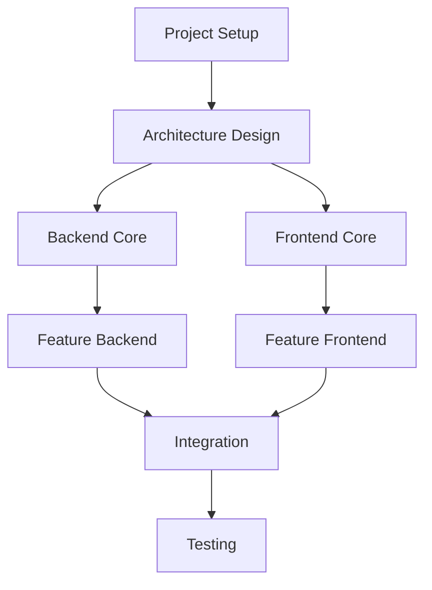

# @generate-task-plan

Generate a comprehensive task plan from the PRD analysis.

## Usage
```
@generate-task-plan
```

## Actions
1. Break down project into phases
2. Create task hierarchy
3. Estimate effort for each task
4. Identify dependencies
5. Propose development sequence

## Template

Based on the PRD analysis, I'll generate a comprehensive task plan.

## Master Task Plan

### Phase 1: Foundation (Week 1-2)
1. **Project Setup**
   - Initialize repository
   - Set up development environment
   - Configure build tools
   - Establish CI/CD pipeline
   
2. **Architecture Design**
   - Design system architecture
   - Create data models
   - Define API specifications
   - Plan component structure

### Phase 2: Core Development (Week 3-6)
1. **Backend Development**
   - Database setup and migrations
   - Core API endpoints
   - Authentication system
   - Business logic implementation
   
2. **Frontend Development**
   - Component library setup
   - Core UI components
   - State management
   - Routing implementation

### Phase 3: Feature Implementation (Week 7-10)
1. **Feature Set A**
   - [Feature 1]: 3 days
   - [Feature 2]: 2 days
   - Integration: 1 day
   
2. **Feature Set B**
   - [Feature 3]: 4 days
   - [Feature 4]: 3 days
   - Testing: 2 days

### Phase 4: Integration & Polish (Week 11-12)
1. **System Integration**
   - API integration
   - Third-party services
   - Error handling
   - Performance optimization
   
2. **Testing & QA**
   - Unit tests
   - Integration tests
   - E2E tests
   - Bug fixes

### Task Dependencies


### PRP Breakdown
1. **Authentication System PRP**
   - Priority: High
   - Estimated effort: 5 days
   - Dependencies: Database setup
   
2. **User Dashboard PRP**
   - Priority: High
   - Estimated effort: 4 days
   - Dependencies: Authentication
   
3. **Data Management PRP**
   - Priority: Medium
   - Estimated effort: 6 days
   - Dependencies: Core API

### Development Sequence
1. Start with foundation tasks
2. Parallel backend/frontend development
3. Feature implementation in priority order
4. Continuous integration and testing

### Resource Allocation
- Backend: 40% effort
- Frontend: 35% effort
- Testing: 15% effort
- DevOps: 10% effort

Task plan generated. Ready to create individual PRPs.

## Notes
- Provides clear roadmap for development
- Identifies critical path items
- Enables parallel development where possible