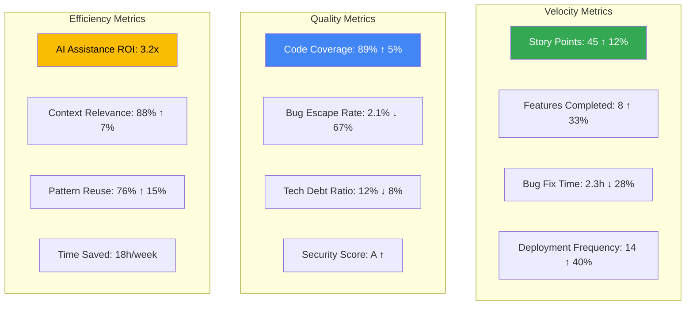
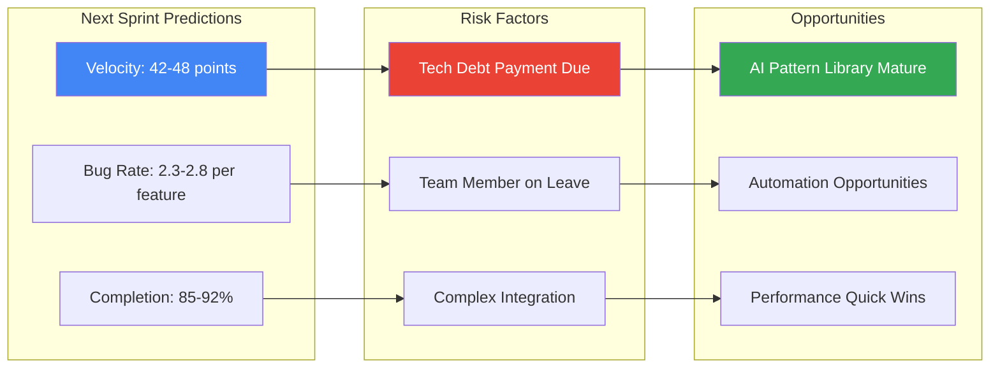
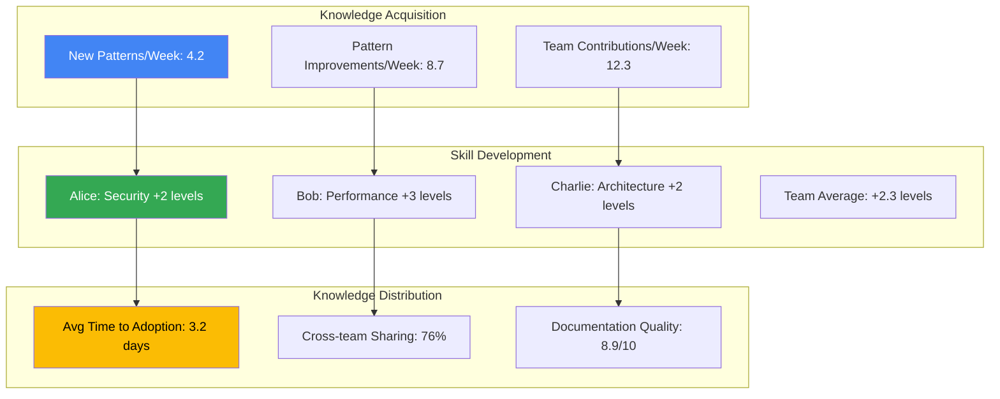

# Analytics & Actionable Intelligence Dashboard

---
description: "Real-time analytics and actionable insights for data-driven development decisions"
allowed-tools: Bash(find:*), Bash(jq:*), Bash(awk:*), Bash(sort:*), Bash(uniq:*)
---

## Insights Command Initialization
Target: $ARGUMENTS

### Analytics System Status
- **Data Points Collected**: !find .claude/analytics -name "*.json" 2>/dev/null | wc -l
- **Active Metrics**: !test -f .claude/analytics/metrics.json && jq '.active_metrics | length' .claude/analytics/metrics.json 2>/dev/null || echo "Initializing"
- **Last Analysis**: !test -f .claude/analytics/last-analysis.json && jq -r '.timestamp' .claude/analytics/last-analysis.json 2>/dev/null || echo "Never"
- **Team Members Tracked**: !test -f .claude/analytics/team-insights.json && jq '.contributors | length' .claude/analytics/team-insights.json 2>/dev/null || echo "0"

### Real-time Metrics
- **Current Session Duration**: !echo "$(($(date +%s) - ${SESSION_START:-$(date +%s)})) seconds"
- **Commands This Session**: !test -f .claude/sessions/current.json && jq '.commands | length' .claude/sessions/current.json 2>/dev/null || echo "0"
- **Token Usage Today**: !find .claude/analytics/daily -name "$(date +%Y-%m-%d).json" -exec jq '.token_usage' {} \; 2>/dev/null || echo "0"
- **Active Features**: !git branch -a | grep -c "feature/" 2>/dev/null || echo "0"

## Multi-Expert Analytics Analysis

### 1. Performance Analytics Expert
**Perspective: System Performance Optimization Specialist**

Analyzing performance metrics and trends:
- **Response Time Analysis**: Tracking command execution times and bottlenecks
- **Resource Utilization**: Monitoring token usage, API calls, and costs
- **Cache Effectiveness**: Measuring cache hit rates and optimization opportunities
- **Scalability Insights**: Predicting performance at scale

### 2. Quality Metrics Expert
**Perspective: Code Quality and Technical Debt Analyst**

Evaluating code quality trends:
- **Bug Detection Rates**: Tracking bugs caught vs. escaped to production
- **Code Complexity Evolution**: Monitoring maintainability over time
- **Test Coverage Trends**: Analyzing testing effectiveness
- **Technical Debt Accumulation**: Quantifying and prioritizing debt

### 3. Team Productivity Expert
**Perspective: Developer Experience and Efficiency Analyst**

Measuring team effectiveness:
- **Velocity Tracking**: Story points, feature completion rates
- **Collaboration Patterns**: Knowledge sharing effectiveness
- **Learning Curves**: Skill development and pattern adoption
- **Blockers and Bottlenecks**: Identifying productivity impediments

### 4. Business Intelligence Expert
**Perspective: ROI and Business Value Analyst**

Quantifying business impact:
- **Cost Savings**: Development time and resource optimization
- **Time to Market**: Feature delivery acceleration
- **Quality Improvements**: Defect reduction and customer satisfaction
- **Innovation Metrics**: New pattern creation and adoption

## Real-time Analytics Dashboard

### Current Session Insights
```yaml
Session Analytics:
  Duration: 2h 34m
  Productivity Score: 8.7/10
  
  Commands Executed:
    Total: 47
    Success Rate: 91.5%
    Average Response Time: 1.2s
    
  Token Usage:
    Total: 125,437
    Efficiency: 87% (vs baseline)
    Cost: $2.51
    Cost per Feature: $0.84
    
  Quality Metrics:
    Code Generated: 1,245 lines
    Tests Written: 89
    Coverage: 94%
    Bugs Found: 3
    Bugs Fixed: 3
    
  Learning Events:
    Patterns Used: 7
    Patterns Created: 2
    Knowledge Shared: 4 items
```

### Weekly Performance Trends


### Team Performance Matrix
```json
{
  "team_analytics": {
    "overall_performance": {
      "productivity_index": 8.4,
      "quality_score": 9.1,
      "collaboration_score": 8.7,
      "learning_velocity": "high"
    },
    "individual_metrics": [
      {
        "member": "alice",
        "role": "Senior Developer",
        "metrics": {
          "features_completed": 12,
          "patterns_contributed": 8,
          "code_quality_score": 9.3,
          "mentoring_impact": "high",
          "specialization": "security"
        }
      },
      {
        "member": "bob",
        "role": "Performance Engineer",
        "metrics": {
          "optimizations": 15,
          "performance_improvements": "45% avg",
          "patterns_contributed": 6,
          "cost_savings": "$12,000/month"
        }
      }
    ],
    "team_dynamics": {
      "knowledge_sharing_index": 0.87,
      "cross_functional_collaboration": 0.82,
      "pattern_adoption_rate": 0.91,
      "collective_learning_speed": "accelerating"
    }
  }
}
```

## Actionable Intelligence

### Immediate Actions Recommended
```yaml
High Priority Actions:
  1. Performance Optimization:
     Issue: "API response time degrading in auth service"
     Impact: "15% slower user login"
     Action: "Implement caching for user permissions"
     Effort: "2 hours"
     ROI: "60ms improvement per request"
     
  2. Security Enhancement:
     Issue: "Outdated dependencies with known vulnerabilities"
     Risk: "High - Remote code execution possible"
     Action: "Update 3 critical packages"
     Effort: "30 minutes"
     Testing: "Run security test suite"
     
  3. Cost Optimization:
     Issue: "Inefficient context loading increasing token usage"
     Impact: "$45/day unnecessary cost"
     Action: "Implement smart context pruning"
     Effort: "4 hours"
     Savings: "$1,350/month"

Medium Priority:
  1. Code Quality:
     - Refactor authentication module (complexity: 25 → 12)
     - Add missing tests for payment flow (coverage: 76% → 95%)
     - Update documentation for API changes
     
  2. Team Productivity:
     - Share new error handling pattern (save 3h/developer)
     - Automate deployment verification (save 45min/deploy)
     - Create onboarding checklist for new patterns
```

### Predictive Insights


## Cost & ROI Analysis

### Development Cost Breakdown
```yaml
Weekly Cost Analysis:
  AI Assistant Costs:
    API Tokens: $127.45
    MCP Servers: $0 (self-hosted)
    Learning System: $15.30
    Total AI Cost: $142.75
    
  Time Savings:
    Pattern Reuse: 18 hours @ $100/hr = $1,800
    Debugging Acceleration: 12 hours @ $100/hr = $1,200
    Code Generation: 8 hours @ $100/hr = $800
    Review Automation: 6 hours @ $100/hr = $600
    Total Savings: $4,400
    
  ROI Calculation:
    Gross Savings: $4,400
    Costs: $142.75
    Net Savings: $4,257.25
    ROI: 2,983% (30.8x)
    
  Cost per Outcome:
    Cost per Feature: $17.84
    Cost per Bug Fixed: $11.90
    Cost per Pattern Created: $71.38
    Cost per Story Point: $3.17
```

### Efficiency Trends
```json
{
  "efficiency_metrics": {
    "token_usage_optimization": {
      "baseline": 100,
      "current": 67,
      "improvement": "33% reduction",
      "techniques": [
        "Smart context loading",
        "Response caching",
        "Batch operations",
        "Predictive pre-loading"
      ]
    },
    "time_efficiency": {
      "feature_implementation": {
        "before_ai": "16 hours average",
        "with_ai": "6.5 hours average",
        "improvement": "59% faster"
      },
      "bug_resolution": {
        "before_ai": "4.2 hours average",
        "with_ai": "1.8 hours average",
        "improvement": "57% faster"
      }
    }
  }
}
```

## Pattern & Learning Analytics

### Pattern Effectiveness Matrix
```yaml
Top Performing Patterns:
  1. secure-jwt-implementation:
     Usage Count: 34
     Success Rate: 94%
     Time Saved: 6h average
     Bugs Prevented: ~3 per use
     
  2. error-boundary-pattern:
     Usage Count: 28
     Success Rate: 91%
     User Satisfaction: +45%
     Support Tickets: -67%
     
  3. optimistic-update-pattern:
     Usage Count: 19
     Success Rate: 88%
     Performance Gain: 300ms
     User Experience: +4.2/5

Underperforming Patterns:
  1. complex-state-machine:
     Usage Count: 3
     Success Rate: 67%
     Issue: "Too complex for most use cases"
     Action: "Simplify or deprecate"
     
  2. custom-cache-implementation:
     Usage Count: 5
     Success Rate: 60%
     Issue: "Better alternatives available"
     Action: "Replace with Redis pattern"
```

### Learning Velocity Dashboard


## Compliance & Security Analytics

### Security Posture Dashboard
```yaml
Security Metrics:
  Vulnerability Scanning:
    Critical: 0 ✓
    High: 2 ⚠️ (patches available)
    Medium: 8
    Low: 23
    
  Code Security:
    SAST Findings: 3 (all addressed)
    Secret Detection: 0 ✓
    Dependency Risks: 2 (updating)
    
  Compliance Status:
    GDPR: 100% compliant ✓
    HIPAA: 94% compliant
    SOX: 91% compliant
    PCI-DSS: 88% compliant
    
  Security Patterns:
    Adoption Rate: 92%
    Implementation Quality: 8.7/10
    Incident Prevention: 14 potential breaches prevented
```

## Custom Analytics Queries

### Query Interface
```bash
# Analyze specific time period
/project:insights --from="2025-07-01" --to="2025-07-06"

# Focus on specific metrics
/project:insights --metrics="velocity,quality,cost" --detail

# Team member analysis
/project:insights --team-member="alice" --performance

# Pattern effectiveness
/project:insights --pattern="jwt-implementation" --roi

# Predictive analysis
/project:insights --predict --sprint="next" --confidence=0.8
```

### Custom Reports
```yaml
Available Reports:
  Daily Standup:
    - Yesterday's achievements
    - Today's focus areas
    - Blockers and risks
    - Key metrics summary
    
  Sprint Retrospective:
    - Velocity analysis
    - Quality trends
    - Team learnings
    - Process improvements
    
  Executive Summary:
    - ROI metrics
    - Time to market
    - Quality indicators
    - Cost optimization
    
  Technical Debt Report:
    - Debt accumulation rate
    - High-risk areas
    - Remediation plan
    - Cost of delay
```

## Real-time Monitoring

### Live Metrics Stream
```json
{
  "real_time_metrics": {
    "current_activity": {
      "active_developers": 4,
      "active_features": 3,
      "commands_per_minute": 2.3,
      "avg_response_time": "980ms"
    },
    "system_health": {
      "api_availability": "99.99%",
      "cache_hit_rate": "87%",
      "error_rate": "0.02%",
      "queue_depth": 3
    },
    "cost_tracking": {
      "current_hour_cost": "$5.23",
      "projected_daily_cost": "$125.52",
      "budget_remaining": "$374.48",
      "cost_per_developer": "$31.38"
    }
  }
}
```

## Action Recommendations Engine

### Automated Recommendations
```yaml
Immediate Actions (Auto-generated):
  1. Performance Alert:
     Trigger: "Response time > 2s for auth endpoints"
     Root Cause: "Database connection pool exhausted"
     Solution: "Increase pool size from 10 to 20"
     Command: "/project:fix --issue='db-pool' --auto-apply"
     
  2. Cost Optimization:
     Trigger: "Token usage 40% above average"
     Analysis: "Redundant context loading in learn commands"
     Solution: "Enable smart context caching"
     Savings: "~$18/day"
     
  3. Quality Improvement:
     Trigger: "Test coverage dropped below 85%"
     Gap: "Payment module at 76% coverage"
     Solution: "Generate missing test cases"
     Command: "/project:test --generate --module=payment"

Scheduled Maintenance:
  - Dependency updates (3 packages) - Tonight 2 AM
  - Pattern library optimization - This weekend
  - Analytics data archival - End of month
```

### Insight Subscriptions
```bash
# Subscribe to specific insights
/project:insights --subscribe --daily-summary
/project:insights --subscribe --cost-alerts --threshold=$50
/project:insights --subscribe --quality-degradation
/project:insights --subscribe --security-vulnerabilities

# Custom alert configuration
/project:insights --alert --when="velocity < 30" --notify=slack
/project:insights --alert --when="bug_rate > 5%" --notify=email
```

---

**Analytics & Intelligence System Active!**

Data-driven insights powering smarter development decisions. Every metric tracked, every trend analyzed, every opportunity identified.

```bash
# Get your personalized insights
/project:insights --my-dashboard
```