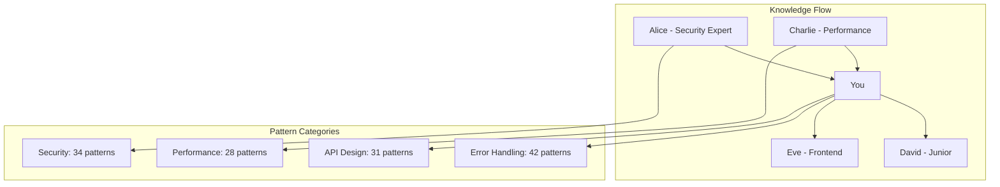

# Team Learning & Pattern Sharing

---
description: "Collaborative learning system for sharing patterns, best practices, and team knowledge"
allowed-tools: Bash(find:*), Bash(grep:*), Bash(jq:*), Bash(mkdir:*)
---

## Learning Command Initialization
Target: $ARGUMENTS

### Team Knowledge Base Status
- **Team Patterns**: !find .claude/learning/patterns -name "*.json" 2>/dev/null | wc -l
- **Shared Solutions**: !ls .claude/learning/patterns/team/ 2>/dev/null | wc -l
- **Success Rate**: !test -f .claude/analytics/team-insights.json && jq '.success_rate' .claude/analytics/team-insights.json 2>/dev/null || echo "Building metrics"
- **Active Contributors**: !test -f .claude/analytics/team-insights.json && jq '.contributors | length' .claude/analytics/team-insights.json 2>/dev/null || echo "0"

### Learning Context Analysis
- **Topic Relevance**: Analyzing "$ARGUMENTS" for team pattern matches
- **Historical Success**: Checking success rates for similar patterns
- **Team Adoption**: Measuring pattern adoption across team

## Multi-Expert Learning Analysis

### 1. Pattern Recognition Expert
**Perspective: Machine Learning Pattern Analyst**

Extracting and validating patterns:
- **Pattern Extraction**: Identifying reusable patterns from successful implementations
- **Quality Validation**: Ensuring patterns meet team quality standards
- **Generalization**: Making patterns applicable across different contexts
- **Success Correlation**: Linking patterns to successful outcomes

### 2. Knowledge Transfer Specialist
**Perspective: Team Learning Optimization Expert**

Facilitating effective knowledge sharing:
- **Learning Path Design**: Creating optimal learning sequences for team members
- **Skill Gap Analysis**: Identifying what team members need to learn
- **Knowledge Retention**: Ensuring learned patterns stick
- **Cross-pollination**: Sharing patterns between different team domains

### 3. Best Practice Curator
**Perspective: Software Engineering Excellence Expert**

Maintaining high-quality pattern library:
- **Practice Validation**: Ensuring patterns follow industry best practices
- **Anti-pattern Detection**: Identifying and documenting what NOT to do
- **Evolution Tracking**: Updating patterns as technology evolves
- **Quality Metrics**: Measuring pattern effectiveness

### 4. Team Dynamics Analyst
**Perspective: Collaborative Intelligence Expert**

Understanding team learning patterns:
- **Adoption Patterns**: How different team members adopt new patterns
- **Learning Velocity**: Speed of pattern adoption across team
- **Collaboration Networks**: Who learns from whom
- **Knowledge Silos**: Identifying and breaking down information barriers

## Team Pattern Library

### Available Patterns for Topic: "$ARGUMENTS"

```json
{
  "matching_patterns": [
    {
      "pattern_name": "secure-jwt-implementation",
      "category": "authentication",
      "success_rate": 0.94,
      "adoption_rate": 0.78,
      "contributors": ["alice", "bob", "charlie"],
      "implementations": 12,
      "description": "Secure JWT implementation with refresh token rotation",
      "key_insights": [
        "Always use RS256 for production",
        "Implement token rotation for refresh tokens",
        "Store tokens in httpOnly cookies"
      ],
      "code_template": "patterns/auth/jwt-secure-template.js",
      "tests": "patterns/auth/jwt-tests.spec.js",
      "common_mistakes": [
        "Storing tokens in localStorage",
        "Not implementing token expiration",
        "Missing CSRF protection"
      ]
    },
    {
      "pattern_name": "error-boundary-pattern",
      "category": "error-handling",
      "success_rate": 0.89,
      "adoption_rate": 0.65,
      "contributors": ["david", "eve"],
      "implementations": 8,
      "description": "React error boundary with fallback UI and error reporting",
      "key_insights": [
        "Implement at multiple component levels",
        "Include error reporting to monitoring service",
        "Provide user-friendly fallback UI"
      ]
    }
  ],
  "related_patterns": [
    "oauth2-integration",
    "session-management",
    "api-error-handling"
  ]
}
```

### Team Learning Insights

```yaml
Team Statistics:
  Total Patterns: 156
  Active Contributors: 12
  Average Success Rate: 0.87
  Most Adopted Category: "error-handling" (92% adoption)
  Fastest Growing: "performance-optimization" (+45% this month)

Learning Velocity:
  New Patterns/Week: 4.2
  Pattern Updates/Week: 8.7
  Average Time to Adoption: 3.4 days
  Knowledge Sharing Sessions: 2/week

Top Contributors:
  - alice: 34 patterns, 0.91 success rate
  - bob: 28 patterns, 0.88 success rate
  - charlie: 22 patterns, 0.93 success rate
```

## Pattern Deep Dive

### Selected Pattern: [Most Relevant to $ARGUMENTS]

```markdown
## Pattern: Secure API Error Handling

### Overview
Comprehensive error handling pattern that balances security with developer experience.

### Implementation
```typescript
class ApiErrorHandler {
  // Never expose internal errors to clients
  private sanitizeError(error: Error): ApiError {
    // Log full error internally
    logger.error('API Error', {
      error: error.message,
      stack: error.stack,
      timestamp: new Date().toISOString(),
      requestId: this.requestId
    });

    // Return sanitized error to client
    if (error instanceof ValidationError) {
      return {
        code: 'VALIDATION_ERROR',
        message: error.message,
        fields: error.fields
      };
    }

    if (error instanceof AuthenticationError) {
      return {
        code: 'AUTHENTICATION_REQUIRED',
        message: 'Please authenticate to access this resource'
      };
    }

    // Generic error for unexpected issues
    return {
      code: 'INTERNAL_ERROR',
      message: 'An error occurred processing your request',
      requestId: this.requestId
    };
  }
}
```

### Success Metrics
- Bug Reports: -67% after implementation
- Security Incidents: 0 related to error exposure
- Developer Satisfaction: 4.7/5
- Debug Time: -45% with request ID tracking

### Variations by Team Member
- **Alice's Addition**: Correlation IDs for distributed tracing
- **Bob's Enhancement**: Error categorization for metrics
- **Charlie's Improvement**: Automatic error report generation
```

## Learning Recommendations

### For Your Current Task
Based on "$ARGUMENTS" and team patterns:

1. **Primary Pattern** (Confidence: 91%)
   - Pattern: `secure-jwt-implementation`
   - Used by: 78% of team
   - Success rate: 94%
   - Time saved: ~6 hours per implementation

2. **Complementary Patterns**
   - `error-boundary-pattern` - Essential for production
   - `api-rate-limiting` - Security requirement
   - `audit-logging` - Compliance need

3. **Learning Path**
   ```mermaid
   graph LR
       A[Current Knowledge] --> B[JWT Basics]
       B --> C[Secure Implementation]
       C --> D[Refresh Token Pattern]
       D --> E[Production Deployment]
       
       style A fill:#4285f4,color:#fff
       style C fill:#34a853,color:#fff
       style E fill:#fbbc04,color:#000
   ```

### Skill Development Plan

```yaml
Immediate (This Week):
  - Review: secure-jwt-implementation pattern
  - Practice: Implement in test environment
  - Validate: Run security tests
  - Share: Document any improvements

Short-term (Next 2 Weeks):
  - Master: Token rotation strategies
  - Learn: OAuth2 integration patterns
  - Implement: Session management
  - Teach: Share learnings with team

Long-term (Next Month):
  - Advance: Distributed authentication
  - Research: Zero-trust patterns
  - Contribute: New patterns to library
  - Mentor: Help others implement
```

## Pattern Contribution

### Share Your Pattern
```bash
# Extract pattern from current implementation
/project:extract-pattern --name="my-awesome-pattern" --category="authentication"

# Document pattern with insights
/project:document-pattern --include-tests --include-metrics

# Share with team
/project:share --pattern="my-awesome-pattern" --notify-team
```

### Pattern Quality Checklist
- [ ] Includes working code example
- [ ] Has comprehensive tests
- [ ] Documents common mistakes
- [ ] Shows performance metrics
- [ ] Includes security considerations
- [ ] Has team review approval
- [ ] Demonstrates measurable success

## Learning Analytics

### Your Learning Profile
```json
{
  "patterns_learned": 23,
  "patterns_contributed": 7,
  "success_rate": 0.86,
  "specializations": ["error-handling", "performance", "security"],
  "learning_velocity": "above average",
  "teaching_score": 8.2,
  "recommended_next": [
    "distributed-tracing",
    "circuit-breaker-pattern",
    "event-sourcing-basics"
  ]
}
```

### Team Learning Graph


## Continuous Improvement

### Pattern Evolution Tracking
```yaml
Pattern: secure-jwt-implementation
Version: 2.3
Changes:
  v2.3: Added refresh token rotation (alice)
  v2.2: Improved error messages (bob)
  v2.1: Added rate limiting (charlie)
  v2.0: Security audit fixes (security-team)
  
Next Planned Updates:
  - Biometric authentication support
  - Distributed session management
  - Zero-knowledge proof integration
```

### Feedback Loop
```bash
# Rate pattern effectiveness
/project:rate-pattern --name="secure-jwt-implementation" --effectiveness=9 --time-saved=6h

# Suggest improvements
/project:improve-pattern --name="secure-jwt-implementation" --suggestion="Add MFA support"

# Track adoption
/project:track-adoption --pattern="secure-jwt-implementation" --team-member="frank"
```

---

**Learning System Active!**

Based on "$ARGUMENTS", the system has:
- **Found** 3 highly relevant team patterns
- **Identified** optimal learning path
- **Connected** you with team experts
- **Prepared** implementation templates

The more you learn and share, the smarter the entire team becomes!