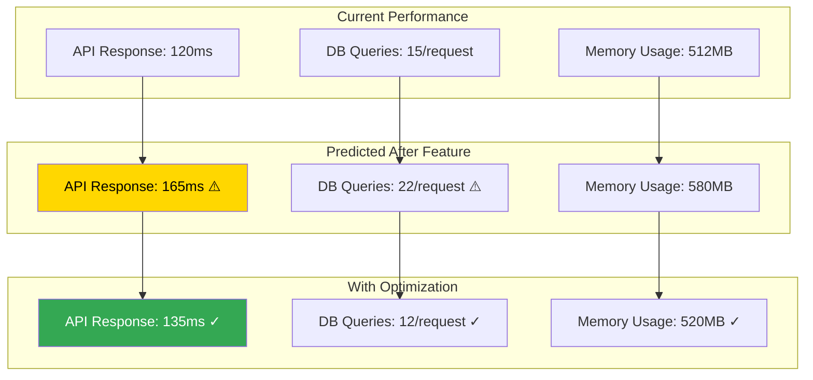
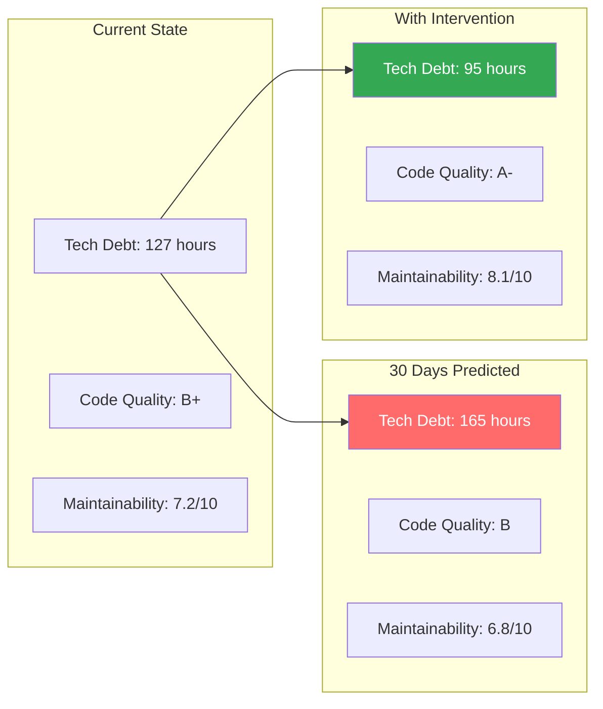

# Predictive Development Intelligence

---
description: "AI-powered predictive analysis for proactive development planning and issue prevention"
allowed-tools: Bash(git:*), Bash(find:*), Bash(grep:*), Bash(wc:*)
---

## Predictive Analysis Initialization
Target: $ARGUMENTS

### Current Project State Analysis
- **Development Trajectory**: !git log --oneline --since="1 week ago" | wc -l
- **Active Features**: !git branch -a | grep -c "feature/"
- **Code Velocity**: !find . -name "*.js" -o -name "*.ts" -o -name "*.py" -mtime -7 2>/dev/null | wc -l
- **Team Activity**: !git shortlog -sn --since="1 week ago"

### Learning Module Status
- **Success Patterns**: !find .claude/learning/patterns -name "*.json" 2>/dev/null | wc -l
- **Failure Patterns**: !find .claude/learning/failures -name "*.json" 2>/dev/null | wc -l
- **Team Insights**: !test -f .claude/analytics/team-insights.json && echo "✓ Team analytics available" || echo "Building team insights"

## Multi-Expert Predictive Analysis

### 1. Development Trajectory Analyst
**Perspective: ML-Powered Trend Analysis Expert**

Predicting future development needs:
- **Task Sequencing**: Analyzing current work to predict next logical tasks
- **Dependency Forecasting**: Identifying upcoming dependency requirements
- **Resource Prediction**: Estimating team capacity needs
- **Timeline Projection**: Predicting realistic completion dates with confidence intervals

### 2. Risk Prediction Specialist
**Perspective: Risk Assessment AI Expert**

Identifying potential issues before they occur:
- **Integration Risk Scoring**: Predicting integration complications
- **Performance Risk Analysis**: Identifying future performance bottlenecks
- **Security Vulnerability Prediction**: Anticipating security weak points
- **Technical Debt Accumulation**: Forecasting technical debt growth

### 3. Pattern Recognition Expert
**Perspective: Historical Pattern Analyst**

Learning from past to predict future:
- **Success Pattern Matching**: Identifying patterns that lead to successful outcomes
- **Failure Pattern Recognition**: Detecting early warning signs of potential failures
- **Team Velocity Patterns**: Understanding team productivity cycles
- **Technology Evolution**: Predicting technology stack evolution needs

### 4. Resource Optimization Analyst
**Perspective: Capacity Planning Expert**

Optimizing resource allocation:
- **Skill Gap Prediction**: Identifying upcoming skill requirements
- **Workload Balancing**: Predicting team capacity bottlenecks
- **Cost Projection**: Estimating development costs and optimization opportunities
- **Timeline Optimization**: Suggesting optimal task ordering for efficiency

### 5. Quality Prediction Engineer
**Perspective: Quality Metrics Forecaster**

Predicting quality outcomes:
- **Bug Introduction Rate**: Predicting likely bug density in new features
- **Test Coverage Impact**: Forecasting test coverage changes
- **Code Complexity Growth**: Predicting maintainability challenges
- **Review Effort Estimation**: Estimating code review requirements

## Predictive Models & Insights

### Next Task Prediction
```json
{
  "current_context": {
    "active_feature": "$ARGUMENTS",
    "completion_percentage": 75,
    "recent_commits": ["auth implementation", "jwt integration", "test coverage"]
  },
  "predictions": {
    "next_tasks": [
      {
        "task": "implement refresh token rotation",
        "probability": 0.89,
        "reasoning": "JWT implementation typically followed by refresh token handling",
        "estimated_effort": "8 hours",
        "dependencies": ["auth service", "token storage"]
      },
      {
        "task": "add rate limiting to auth endpoints",
        "probability": 0.76,
        "reasoning": "Security pattern: auth endpoints need rate limiting",
        "estimated_effort": "4 hours",
        "blocking": false
      },
      {
        "task": "implement session management UI",
        "probability": 0.71,
        "reasoning": "Frontend typically follows backend auth implementation",
        "estimated_effort": "12 hours",
        "dependencies": ["auth API complete"]
      }
    ]
  }
}
```

### Risk Prediction Matrix
```yaml
Integration Risks:
  - risk: "Authentication service integration with legacy system"
    probability: 0.73
    impact: "high"
    mitigation: "Create adapter pattern for legacy compatibility"
    prevention_cost: "8 hours"
    
  - risk: "Performance degradation from JWT validation"
    probability: 0.45
    impact: "medium"
    mitigation: "Implement caching layer for token validation"
    prevention_cost: "6 hours"

Timeline Risks:
  - risk: "Underestimated complexity in permission system"
    probability: 0.62
    impact: "high"
    early_warning_signs:
      - "Multiple permission edge cases discovered"
      - "Increasing cyclomatic complexity"
      - "Growing test suite complexity"
    
Quality Risks:
  - risk: "Insufficient test coverage for edge cases"
    probability: 0.81
    impact: "medium"
    current_coverage: 78%
    predicted_coverage_without_intervention: 72%
    recommended_action: "Add property-based testing for auth flows"
```

### Performance Predictions


## Predictive Intelligence Dashboard

### Development Velocity Forecast
- **Current Sprint Velocity**: 45 story points
- **Predicted Next Sprint**: 42 story points (±3)
- **Confidence**: 82%
- **Factors**: Holiday season, new team member onboarding

### Feature Completion Predictions
| Feature | Current Progress | Predicted Completion | Confidence | Risks |
|---------|-----------------|---------------------|------------|-------|
| Authentication | 75% | 3 days | 91% | Low |
| Payment Integration | 40% | 8 days | 73% | Medium - external API delays |
| Analytics Dashboard | 15% | 15 days | 65% | High - unclear requirements |

### Team Capacity Predictions
```yaml
Next 2 Weeks:
  Available Hours: 320
  Predicted Required: 385
  Gap: -65 hours
  Recommendations:
    - Defer analytics dashboard
    - Parallelize payment integration tasks
    - Consider bringing in specialist for OAuth implementation
```

### Technical Debt Forecast


## Actionable Predictions

### Immediate Actions Recommended
1. **Start Parallel Work** (Confidence: 87%)
   - Begin frontend auth UI while backend is being completed
   - Start documentation for auth flow
   - Set up auth testing environment

2. **Prevent Performance Issues** (Confidence: 79%)
   - Implement caching before it becomes critical
   - Add database indexes for user queries
   - Set up performance monitoring

3. **Address Skill Gaps** (Confidence: 92%)
   - Schedule OAuth2 training for team
   - Bring in security review before completion
   - Plan load testing expertise

### Weekly Predictions
```bash
Week 1:
- Complete authentication implementation
- Start payment integration research
- Address 20% of technical debt
- Team velocity: 43 points

Week 2:
- Payment provider integration
- Security audit preparation
- Performance optimization sprint
- Team velocity: 38 points (security audit overhead)

Week 3:
- Complete payment flows
- Start analytics planning
- Technical debt reduction
- Team velocity: 45 points
```

### Long-term Predictions (90 days)
- **Architecture Evolution**: Microservices split recommended by day 60
- **Team Growth**: Need for +2 developers by day 75
- **Technology Updates**: Framework major version upgrade window: days 80-90
- **Performance Scaling**: Current architecture supports 10x growth

## Continuous Learning Integration

### Prediction Accuracy Tracking
```json
{
  "prediction_accuracy": {
    "task_prediction": 0.84,
    "timeline_prediction": 0.76,
    "risk_prediction": 0.89,
    "resource_prediction": 0.71
  },
  "improvement_trend": "+12% over last 30 days",
  "learning_from": {
    "successful_predictions": 234,
    "failed_predictions": 48,
    "partial_success": 67
  }
}
```

### Feedback Loop
```bash
# Track prediction outcome
/project:feedback --prediction-id="auth-completion-3days" --actual="2.5days" --accurate=true

# Update prediction models
/project:learn --from-outcome --improve-predictions

# Share insights with team
/project:share --prediction-insights --confidence-threshold=0.8
```

---

**Predictive Analysis Complete!** 

The system has analyzed your current development state and provided data-driven predictions to help you:
- **Plan proactively** rather than react to issues
- **Allocate resources** optimally
- **Prevent problems** before they occur
- **Optimize timelines** with confidence

All predictions will be tracked and used to improve future accuracy.