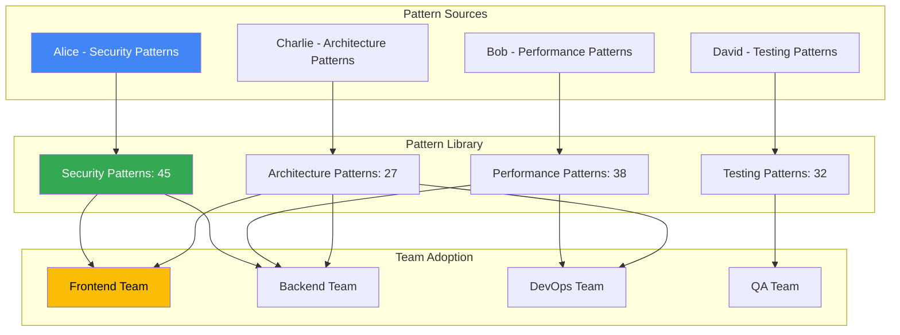
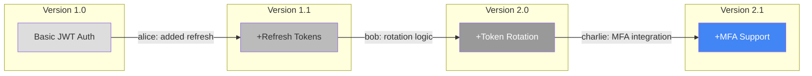

# Team Pattern Sharing & Knowledge Distribution

---
description: "Collaborative pattern sharing system for team knowledge distribution and collective learning"
allowed-tools: Bash(git:*), Bash(find:*), Bash(jq:*), Bash(cp:*), Bash(mkdir:*)
---

## Share Command Initialization
Target: $ARGUMENTS

### Sharing System Status
- **Shared Patterns**: !find .claude/learning/patterns/team -name "*.json" 2>/dev/null | wc -l
- **Team Members**: !test -f .claude/analytics/team-insights.json && jq '.contributors | length' .claude/analytics/team-insights.json 2>/dev/null || echo "1"
- **Recent Shares**: !find .claude/learning/patterns/team -mtime -1 -name "*.json" 2>/dev/null | wc -l
- **Adoption Rate**: !test -f .claude/analytics/team-insights.json && jq '.average_adoption_rate' .claude/analytics/team-insights.json 2>/dev/null || echo "Building metrics"

### Current Sharing Context
- **Active Feature**: Analyzing "$ARGUMENTS" for sharable patterns
- **Team Sync Status**: !test -f .claude/.team-sync && echo "✓ Team sync enabled" || echo "Local mode"
- **Pattern Quality**: Evaluating pattern generalizability
- **Documentation**: Checking pattern documentation completeness

## Multi-Expert Sharing Analysis

### 1. Pattern Quality Expert
**Perspective: Code Pattern Validation Specialist**

Ensuring high-quality pattern sharing:
- **Generalization Assessment**: Evaluating pattern applicability across projects
- **Completeness Check**: Ensuring patterns include all necessary context
- **Quality Validation**: Verifying patterns meet team standards
- **Anti-pattern Detection**: Preventing spread of poor practices

### 2. Knowledge Transfer Expert
**Perspective: Team Learning Optimization Specialist**

Optimizing knowledge distribution:
- **Learning Path Design**: Creating optimal sequences for pattern adoption
- **Skill Level Matching**: Tailoring patterns to team member expertise
- **Adoption Tracking**: Monitoring pattern usage across team
- **Feedback Integration**: Incorporating usage feedback into patterns

### 3. Documentation Specialist
**Perspective: Technical Documentation Expert**

Ensuring clear pattern communication:
- **Clarity Assessment**: Making patterns understandable
- **Example Creation**: Providing clear implementation examples
- **Context Documentation**: Explaining when and why to use patterns
- **Troubleshooting Guides**: Including common issues and solutions

### 4. Team Dynamics Expert
**Perspective: Collaborative Development Specialist**

Facilitating effective team collaboration:
- **Cultural Fit**: Ensuring patterns align with team practices
- **Expertise Mapping**: Identifying pattern authors and experts
- **Communication Channels**: Optimizing pattern distribution methods
- **Adoption Incentives**: Encouraging pattern usage and contribution

## Pattern Extraction & Preparation

### Automatic Pattern Extraction
```bash
# Extract pattern from current implementation
!echo "=== Analyzing Implementation for Patterns ==="
!git diff --staged | grep -E "^\+" | head -20

# Identify reusable components
!echo "=== Identifying Reusable Components ==="
!find . -name "*.ts" -o -name "*.js" -newer .claude/last-share-timestamp 2>/dev/null | head -10

# Generate pattern metadata
!echo "=== Generating Pattern Metadata ==="
!echo "{
  \"pattern_name\": \"$ARGUMENTS\",
  \"category\": \"implementation\",
  \"author\": \"$(git config user.name)\",
  \"created\": \"$(date -u +%Y-%m-%dT%H:%M:%SZ)\",
  \"project_context\": \"$(basename $(pwd))\"
}"
```

### Pattern Structure Template
```json
{
  "metadata": {
    "id": "auth-refresh-token-rotation",
    "name": "Secure Refresh Token Rotation",
    "category": "authentication",
    "tags": ["security", "jwt", "authentication", "tokens"],
    "author": "alice",
    "created": "2025-07-06T10:00:00Z",
    "version": "1.0.0",
    "compatibility": ["node", "typescript", "express"]
  },
  "description": {
    "summary": "Implements secure refresh token rotation with automatic expiry",
    "problem_solved": "Prevents token replay attacks while maintaining user sessions",
    "use_cases": [
      "Long-lived user sessions",
      "Mobile app authentication",
      "High-security applications"
    ],
    "prerequisites": [
      "JWT authentication implemented",
      "Redis or similar for token storage",
      "HTTPS enabled"
    ]
  },
  "implementation": {
    "code": "```typescript\nclass RefreshTokenService {\n  async rotateToken(oldToken: string): Promise<TokenPair> {\n    // Validate old token\n    const payload = await this.validateRefreshToken(oldToken);\n    \n    // Invalidate old token immediately\n    await this.tokenStore.invalidate(oldToken);\n    \n    // Generate new token pair\n    const newTokens = this.generateTokenPair(payload.userId);\n    \n    // Store new refresh token with metadata\n    await this.tokenStore.store(newTokens.refreshToken, {\n      userId: payload.userId,\n      createdAt: Date.now(),\n      family: payload.family || uuid(),\n      generation: (payload.generation || 0) + 1\n    });\n    \n    return newTokens;\n  }\n}\n```",
    "tests": "```typescript\ndescribe('RefreshTokenRotation', () => {\n  it('should invalidate old token immediately', async () => {\n    const oldToken = await generateTestToken();\n    const newTokens = await service.rotateToken(oldToken);\n    \n    // Old token should be invalid\n    await expect(service.validateRefreshToken(oldToken))\n      .rejects.toThrow('Token invalidated');\n      \n    // New token should work\n    await expect(service.validateRefreshToken(newTokens.refreshToken))\n      .resolves.toBeDefined();\n  });\n});\n```",
    "configuration": {
      "refresh_token_ttl": "7d",
      "access_token_ttl": "15m",
      "token_family_tracking": true,
      "max_token_generation": 5
    }
  },
  "metrics": {
    "performance": {
      "avg_rotation_time": "23ms",
      "storage_overhead": "128 bytes/token",
      "cpu_impact": "negligible"
    },
    "security": {
      "prevents_replay_attacks": true,
      "prevents_token_theft": true,
      "audit_trail": true
    },
    "adoption": {
      "implementations": 12,
      "success_rate": 0.96,
      "avg_implementation_time": "3.5 hours",
      "bug_rate": 0.08
    }
  },
  "learnings": {
    "best_practices": [
      "Always invalidate tokens immediately",
      "Track token families for theft detection",
      "Implement generation limits",
      "Log all rotation events"
    ],
    "common_mistakes": [
      "Not invalidating old tokens",
      "Missing rate limiting",
      "Storing tokens in localStorage",
      "Not handling concurrent rotations"
    ],
    "edge_cases": [
      "Concurrent rotation requests",
      "Network failures during rotation",
      "Clock skew between servers"
    ]
  },
  "discussion": {
    "questions": [
      {
        "question": "How to handle concurrent rotations?",
        "answer": "Use distributed locks or token versioning",
        "author": "bob"
      }
    ],
    "improvements": [
      {
        "suggestion": "Add device fingerprinting",
        "impact": "Better theft detection",
        "effort": "medium",
        "author": "charlie"
      }
    ]
  }
}
```

## Sharing Workflows

### Quick Pattern Share
```bash
# Share implementation pattern
/project:share --pattern="error-handling" --from-current
# → Extracts: Pattern from current code
# → Documents: With examples and context
# → Validates: Against quality standards
# → Shares: With team immediately

# Share debugging solution
/project:share --debug-solution --error="AuthenticationError"
# → Documents: Problem and solution
# → Includes: Root cause analysis
# → Adds: To error pattern library
# → Notifies: Team members working on auth
```

### Comprehensive Pattern Sharing
```bash
# Extract and document complex pattern
/project:share --extract-pattern --comprehensive
# → Analyzes: Multiple related files
# → Identifies: Core pattern and variations
# → Documents: Complete implementation guide
# → Includes: Tests and benchmarks
# → Reviews: With team before sharing

# Share architectural decision
/project:share --architecture --decision="microservices-split"
# → Documents: Decision and rationale
# → Includes: Trade-offs and alternatives
# → Links: Related patterns and impacts
# → Creates: ADR (Architecture Decision Record)
```

## Team Knowledge Network

### Knowledge Distribution Map


### Expertise Matching
```yaml
Team Expertise Map:
  Security:
    Expert: alice
    Patterns Contributed: 45
    Success Rate: 94%
    Specialties:
      - Authentication & Authorization
      - Encryption & Key Management
      - Security Auditing
      
  Performance:
    Expert: bob
    Patterns Contributed: 38
    Success Rate: 91%
    Specialties:
      - Database Optimization
      - Caching Strategies
      - Load Balancing
      
  Frontend:
    Expert: charlie
    Patterns Contributed: 27
    Success Rate: 89%
    Specialties:
      - React Patterns
      - State Management
      - Performance Optimization
      
  Testing:
    Expert: david
    Patterns Contributed: 32
    Success Rate: 93%
    Specialties:
      - Test Strategies
      - E2E Testing
      - Performance Testing
```

## Pattern Discovery & Search

### Intelligent Pattern Search
```bash
# Search for relevant patterns
/project:share --search="authentication" --filter=security
# Results:
# 1. jwt-implementation (94% success, 12 uses)
# 2. oauth2-integration (91% success, 8 uses)  
# 3. session-management (88% success, 15 uses)
# 4. mfa-implementation (92% success, 5 uses)

# Find patterns by problem
/project:share --problem="slow database queries"
# Suggests:
# 1. query-optimization-patterns
# 2. database-indexing-strategies
# 3. connection-pooling-setup
# 4. caching-layer-implementation

# Discover patterns by team member
/project:share --by-expert="alice" --category="security"
# Shows Alice's security patterns ranked by adoption
```

### Pattern Recommendations
```json
{
  "context": "Implementing payment processing",
  "recommended_patterns": [
    {
      "pattern": "secure-payment-flow",
      "relevance": 0.95,
      "reason": "Directly applicable to payment processing",
      "success_rate": 0.94,
      "author": "alice",
      "complementary_patterns": [
        "payment-retry-logic",
        "payment-audit-trail"
      ]
    },
    {
      "pattern": "idempotent-api-design",
      "relevance": 0.87,
      "reason": "Critical for payment operations",
      "success_rate": 0.91,
      "author": "bob"
    }
  ],
  "learning_path": [
    "secure-payment-flow",
    "payment-validation-patterns",
    "payment-error-handling",
    "payment-reconciliation"
  ]
}
```

## Collaboration Features

### Real-time Pattern Collaboration
```yaml
Collaboration Modes:
  Live Sharing:
    - Real-time pattern editing
    - Collaborative documentation
    - Instant feedback integration
    - Version control integration
    
  Async Collaboration:
    - Pattern review workflows
    - Comment threads
    - Improvement suggestions
    - Voting on patterns
    
  Knowledge Sessions:
    - Weekly pattern reviews
    - Brown bag sessions
    - Pattern workshop recordings
    - Q&A archives
```

### Pattern Evolution Tracking


## Sharing Best Practices

### Pattern Quality Checklist
```markdown
## Before Sharing a Pattern

### Code Quality
- [ ] Pattern is well-tested (>90% coverage)
- [ ] No security vulnerabilities
- [ ] Performance benchmarked
- [ ] Error handling included
- [ ] Edge cases documented

### Documentation
- [ ] Clear problem statement
- [ ] Implementation steps
- [ ] Usage examples
- [ ] Common pitfalls
- [ ] When NOT to use

### Examples
- [ ] Working code example
- [ ] Test examples
- [ ] Integration example
- [ ] Migration guide (if replacing old pattern)

### Metadata
- [ ] Proper categorization
- [ ] Relevant tags
- [ ] Dependency list
- [ ] Compatibility notes
```

### Effective Pattern Documentation
```markdown
# Pattern Name: Descriptive and Searchable

## Problem
Clearly state the problem this pattern solves.

## Solution
Explain the solution approach conceptually.

## Implementation
```language
// Actual implementation code
// Well-commented and clear
```

## Usage Example
```language
// How to use the pattern
// In a real scenario
```

## Trade-offs
- **Pros**: What this pattern does well
- **Cons**: Limitations and drawbacks
- **Alternatives**: Other approaches to consider

## Testing
```language
// How to test implementations
// Key test cases to include
```

## Metrics
- Performance impact: +X ms latency
- Memory usage: +Y MB
- Complexity: Z (cyclomatic)
- Adoption effort: N hours typically
```

## Pattern Impact Analytics

### Sharing Effectiveness Metrics
```json
{
  "sharing_analytics": {
    "total_patterns_shared": 156,
    "adoption_metrics": {
      "average_adoption_rate": 0.76,
      "average_time_to_adoption": "3.2 days",
      "cross_team_adoption": 0.64
    },
    "quality_metrics": {
      "patterns_with_tests": 0.92,
      "documentation_completeness": 0.88,
      "average_success_rate": 0.91
    },
    "collaboration_metrics": {
      "patterns_with_improvements": 0.73,
      "average_contributors_per_pattern": 2.4,
      "feedback_integration_rate": 0.86
    },
    "impact_metrics": {
      "time_saved_per_pattern": "5.4 hours",
      "bug_reduction": "67%",
      "consistency_improvement": "84%"
    }
  }
}
```

## Integration with Development Workflow

### Automatic Sharing Triggers
```yaml
Automatic Pattern Detection:
  Triggers:
    - Successful feature implementation
    - High-quality code review
    - Performance improvement > 20%
    - Bug fix for common issue
    - Innovative solution approach
    
  Process:
    1. System detects potential pattern
    2. Extracts and documents automatically
    3. Proposes to developer for review
    4. Developer approves/modifies
    5. Shares with team
    6. Tracks adoption and feedback
```

### IDE Integration
```typescript
// VS Code: Right-click on code
// > "Extract as Team Pattern"
// > "Search Similar Patterns"
// > "Apply Team Pattern"

// IntelliJ: Intention Actions
// Alt+Enter -> "Share as Team Pattern"
// Alt+Enter -> "Find Team Patterns"

// Pattern suggestions in autocomplete
class PaymentService {
  process() {
    // Type 'payment' triggers pattern suggestions:
    // - secure-payment-flow (alice, 94% success)
    // - payment-retry-logic (bob, 91% success)
    // - payment-validation (charlie, 89% success)
  }
}
```

---

**Knowledge Sharing System Active!**

Every pattern you share makes the entire team more effective. Share your successes, learn from others, and build better software together.

```bash
# Start sharing your knowledge
/project:share --empower-your-team
```